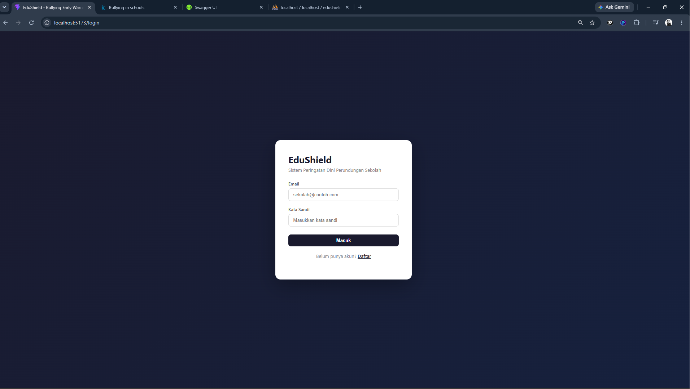
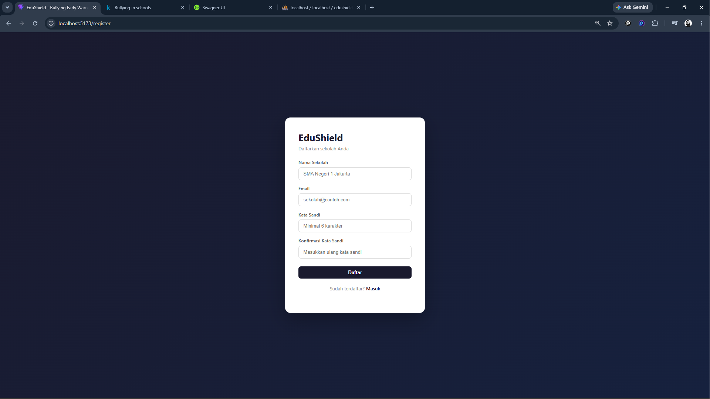
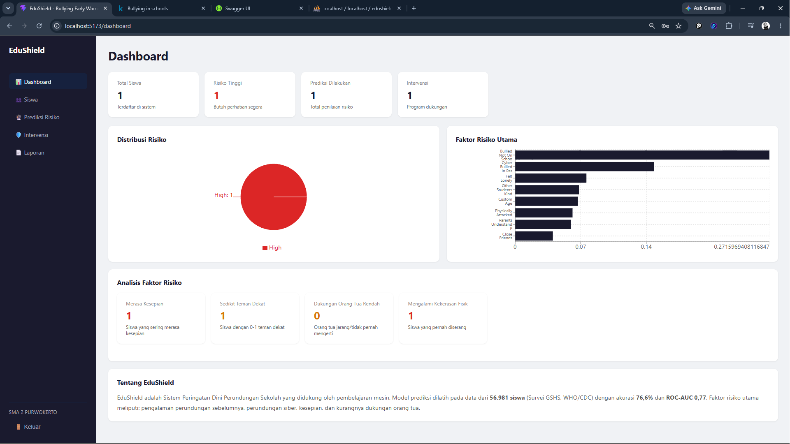
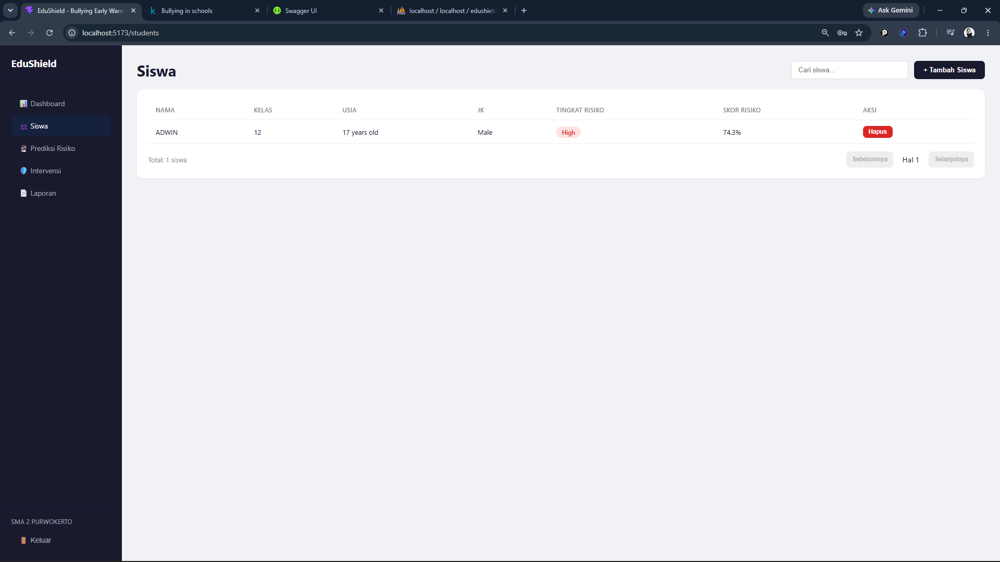
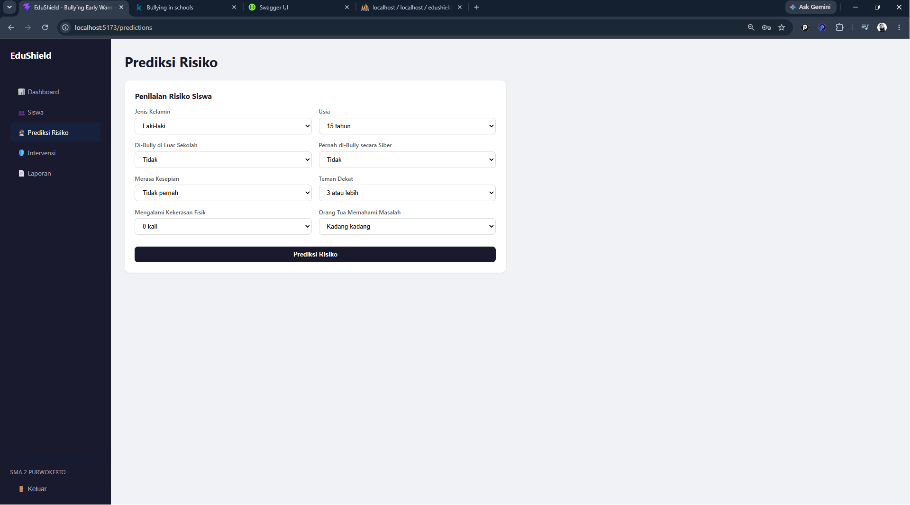
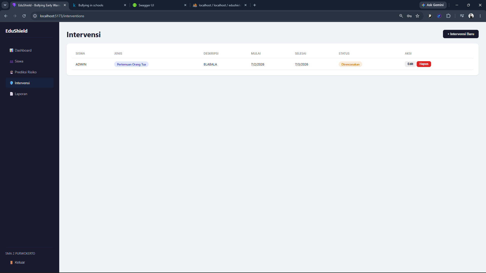
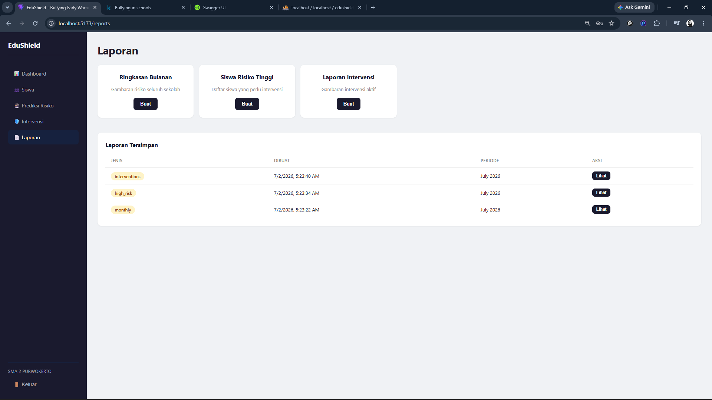
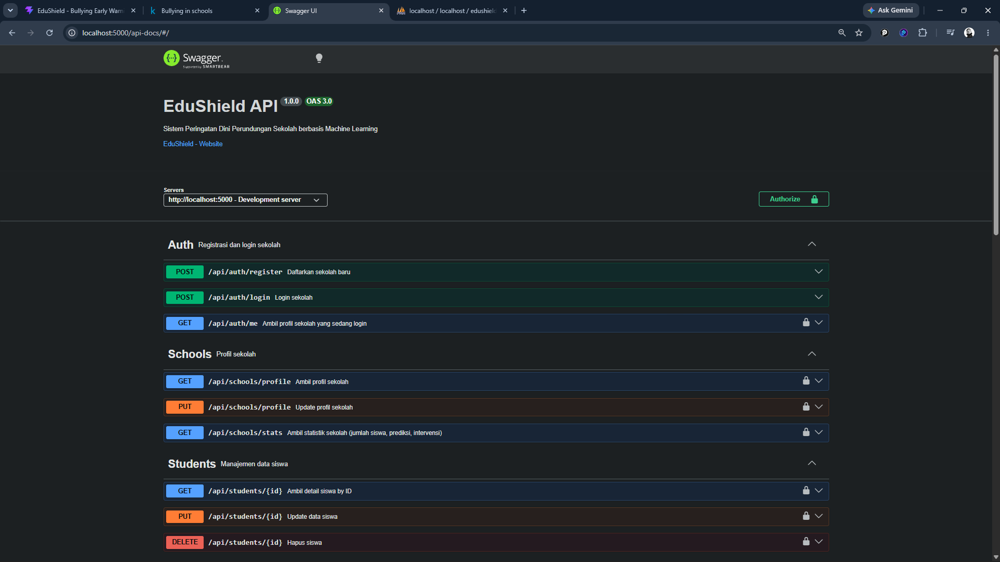

# EduShield — Sistem Peringatan Dini Perundungan Sekolah

EduShield adalah aplikasi web full-stack berbasis Machine Learning untuk mendeteksi dan memprediksi risiko perundungan (bullying) pada siswa sekolah. Dibangun dengan arsitektur PBP (Frontend & REST API terpisah).

---

## Screenshot Aplikasi

| Halaman | Screenshot |
|---|---|
| Login |  |
| Register |  |
| Dashboard |  |
| Manajemen Siswa |  |
| Prediksi Risiko |  |
| Intervensi |  |
| Laporan |  |
| Swagger API Docs |  |

---

## Tech Stack

| Layer | Teknologi |
|---|---|
| Frontend | React (Vite), Axios, Recharts, React Router DOM |
| Backend | Express.js, MySQL (mysql2), JWT, bcryptjs |
| Machine Learning | Python, scikit-learn (RandomForest), pandas, joblib |
| API Documentation | Swagger (swagger-jsdoc + swagger-ui-express) |

---

## Struktur Proyek

```
edushield/
├── backend/
│   ├── src/
│   │   ├── middleware/    # JWT authentication
│   │   ├── routes/        # 7 route files (auth, schools, students, dll)
│   │   ├── db.js          # Koneksi MySQL (connection pool)
│   │   ├── index.js       # Entry point Express
│   │   └── swagger.js     # Konfigurasi OpenAPI 3.0
│   └── package.json
├── frontend/
│   ├── src/
│   │   ├── components/    # Layout dengan sidebar navigasi
│   │   ├── pages/         # 7 halaman (Login, Register, Dashboard, dll)
│   │   └── services/      # Axios API client
│   └── package.json
├── database/
│   ├── schema.sql         # 5 tabel (schools, students, predictions, interventions, reports)
│   └── seed.sql           # Data dummy
├── ml/
│   ├── Bullying_2018.csv          # Dataset GSHS (56.981 siswa)
│   ├── edushield_training.ipynb   # Jupyter notebook training
│   ├── model.pkl                  # Model RandomForest terlatih
│   ├── feature_importance.json    # 16 fitur dengan nilai importance
│   └── predict.py                 # Script inference (dipanggil backend)
├── screenshots/            # Folder hasil screenshot
└── README.md
```

---

## Arsitektur Aplikasi

### Arsitektur PBP (Pemisahan Frontend & Backend)

Aplikasi ini mengikuti arsitektur PBP di mana Frontend dan Backend merupakan dua proyek terpisah yang berkomunikasi melalui REST API.

```
BROWSER (localhost:5173)
       │
       │ HTTP Request (JSON)
       │ Authorization: Bearer <JWT>
       ▼
┌──────────────────────────────────────┐
│         FRONTEND (React Vite)         │
│                                      │
│  Login │ Register │ Dashboard        │
│  Siswa │ Prediksi │ Intervensi      │
│  Laporan                             │
│                                      │
│  services/api.js → axios → port 5000 │
└──────────────────┬───────────────────┘
                   │
                   ▼
┌──────────────────────────────────────┐
│         BACKEND (Express.js)          │
│                                      │
│  Middleware:                          │
│    helmet() → cors() → express.json()│
│    → auth.js (JWT verify)            │
│                                      │
│  Routes:                             │
│    /api/auth       → register/login  │
│    /api/students   → CRUD + prediksi │
│    /api/predictions → prediksi mandiri│
│    /api/analytics  → dashboard data  │
│    /api/interventions → CRUD         │
│    /api/reports    → generate/lihat  │
│                                      │
│  Dokumentasi:                        │
│    /api-docs → Swagger UI            │
└──────────┬───────────────┬───────────┘
           │               │
           ▼               ▼
┌─────────────────┐ ┌─────────────────┐
│     MySQL DB    │ │   Python ML     │
│                 │ │                 │
│  pool.query()   │ │  child_process  │
│                 │ │  execSync()     │
│  5 tabel        │ │  ml/predict.py  │
└─────────────────┘ └─────────────────┘
```

### Alur Data

1. **User** membuka frontend di browser (port 5173)
2. **Frontend** mengirim HTTP request ke backend (port 5000) via Axios
3. **Backend** menerima request, melewati middleware JWT untuk verifikasi token
4. **Backend** memproses request — membaca/menulis ke MySQL via `pool.query()`
5. **Backend** memanggil Python ML via `child_process.execSync()` untuk prediksi risiko
6. **Backend** mengembalikan response JSON ke frontend
7. **Frontend** merender data dengan komponen React dan Recharts

### Bukti PBP

| Bukti | Keterangan |
|---|---|
| Dua proyek terpisah | Folder `backend/` dan `frontend/` masing-masing punya `package.json` sendiri |
| Frontend tidak akses DB | Semua komunikasi melalui `http://localhost:5000/api` — tidak ada koneksi MySQL dari frontend |
| Backend hanya return JSON | Setiap endpoint menggunakan `res.json()` — bukan HTML |
| Platform agnostic | Backend bisa digunakan oleh frontend React, Flutter, atau platform lain |

---

## Cara Install & Jalankan

### Prasyarat

- Node.js >= 18
- Python >= 3.9 (scikit-learn, pandas, joblib, numpy)
- MySQL (XAMPP/Laragon)

### 1. Clone & Install

```bash
git clone https://github.com/muhammadhumamnuqi-ai/Edu-Shield.git
cd Edu-Shield

cd backend && npm install
cd ../frontend && npm install
```

### 2. Setup Database

Jalankan `database/schema.sql` di MySQL.

### 3. Konfigurasi (.env di backend/)

```
PORT=5000
DB_HOST=localhost
DB_USER=root
DB_PASSWORD=
DB_NAME=edushield
JWT_SECRET=rahasia_edushield_2024
```

### 4. Jalankan

```bash
# Terminal 1
cd backend && npm start    # http://localhost:5000

# Terminal 2
cd frontend && npm run dev # http://localhost:5173
```

---

## API Endpoints

| Method | Endpoint | Deskripsi | Butuh Token? |
|---|---|---|---|
| POST | `/api/auth/register` | Daftar sekolah baru | Tidak |
| POST | `/api/auth/login` | Login sekolah | Tidak |
| GET | `/api/auth/me` | Profil sekolah | Ya |
| GET | `/api/schools/profile` | Profil sekolah | Ya |
| PUT | `/api/schools/profile` | Update profil | Ya |
| GET | `/api/schools/stats` | Statistik dashboard | Ya |
| GET | `/api/students` | Daftar siswa (paginasi) | Ya |
| POST | `/api/students` | Tambah + prediksi siswa | Ya |
| GET | `/api/students/:id` | Detail siswa | Ya |
| PUT | `/api/students/:id` | Update siswa | Ya |
| DELETE | `/api/students/:id` | Hapus siswa | Ya |
| POST | `/api/predictions` | Prediksi risiko manual | Ya |
| GET | `/api/predictions` | Riwayat prediksi | Ya |
| GET | `/api/analytics/dashboard` | Data dashboard | Ya |
| GET | `/api/analytics/feature-importance` | Importance fitur ML | Ya |
| GET | `/api/interventions` | Daftar intervensi | Ya |
| POST | `/api/interventions` | Buat intervensi | Ya |
| PUT | `/api/interventions/:id` | Update intervensi | Ya |
| DELETE | `/api/interventions/:id` | Hapus intervensi | Ya |
| GET | `/api/reports` | Daftar laporan | Ya |
| POST | `/api/reports/generate` | Generate laporan | Ya |
| GET | `/api/reports/:id` | Detail laporan | Ya |

---

## Machine Learning Detail

### Dataset GSHS

- **Sumber:** WHO & CDC — 56.981 siswa global
- **Target:** `Bullied_on_school_property_in_past_12_months` (Yes: 20.9%, No: 79.1%)

### Model: RandomForest

| Parameter | Nilai |
|---|---|
| n_estimators | 100 |
| max_depth | 15 |
| class_weight | balanced |
| Accuracy | 76.58% |
| ROC-AUC | 0.77 |

### Risk Threshold

| Skor | Level | Tindakan |
|---|---|---|
| ≥ 0.6 | High | Intervensi segera |
| 0.3 – 0.6 | Medium | Monitoring |
| < 0.3 | Low | Normal |

---

## Alur Data Lengkap

```
User Buka Browser (http://localhost:5173)
         │
         ▼
    App.jsx (PrivateRoute)
         │
         ├─ token tidak ada → Login.jsx
         │                    └─ POST /api/auth/login → JWT token
         │
         └─ token ada → Layout.jsx (sidebar)
                          │
                          ├─ Dashboard → analytics.getDashboard()
                          │              ├─ pool.query('SELECT COUNT...')
                          │              ├─ pool.query('SELECT risk_level...')
                          │              └─ pool.query('SELECT SUM(CASE...)')
                          │
                          ├─ Students → students.getAll()
                          │              └─ pool.query('SELECT * FROM students WHERE school_id=?')
                          │
                          ├─ Predictions → predictions.create(data)
                          │                 ├─ predictRisk(data) → Python ML
                          │                 └─ pool.query('INSERT INTO predictions...')
                          │
                          ├─ Interventions → interventions.create(data)
                          │                   └─ pool.query('INSERT INTO interventions...')
                          │
                          └─ Reports → reports.generate(type)
                                        ├─ pool.query('SELECT * FROM students WHERE school_id=?')
                                        ├─ pool.query('SELECT * FROM interventions WHERE school_id=?')
                                        └─ pool.query('INSERT INTO reports...')
```

---

## Lisensi

Proyek ini dibuat untuk tujuan edukasi sebagai UAS mata kuliah PBP (Pemrograman Berbasis Platform).
